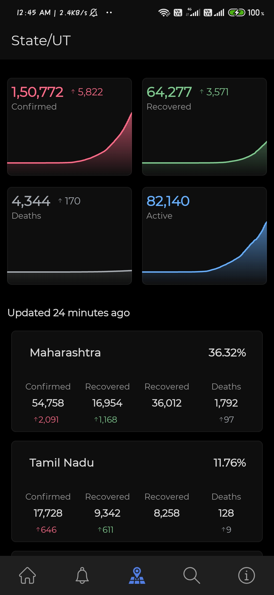
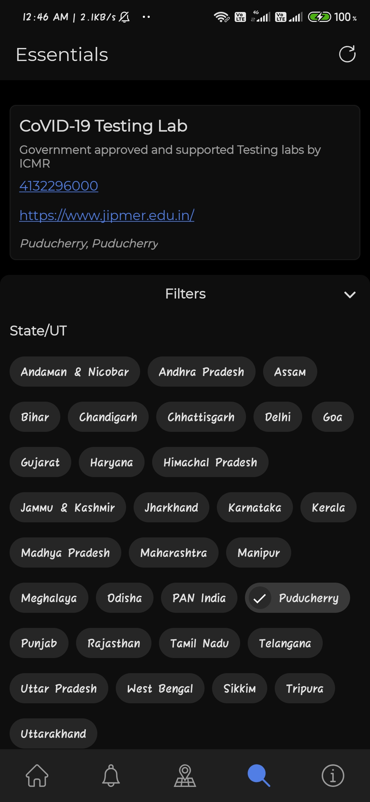
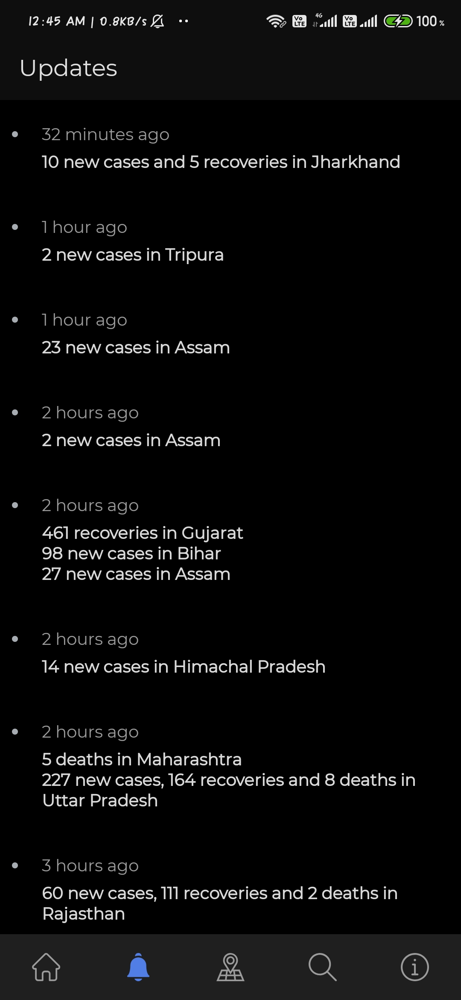

# COVID-19 Tracker 
__Lets break the chain__  
This application displays the latest updates based on numbers from https://www.covid19india.org/

  

### Screenshots
     

## Required Permissions
    android.permission.INTERNET
    android.permission.LOCATION

## Libraries
- Kotlin
- Koin
- MVVM Architecture
- Material Design
- AndroidX
- Kotlin Coroutines
- Retrofit 2
- Android Architecture Component
